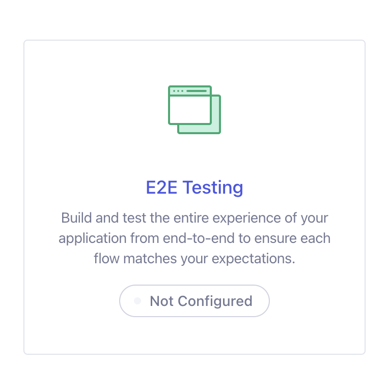
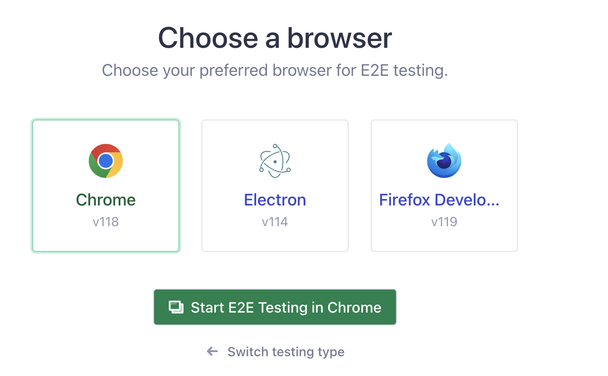

# E2E Testing ✅ with Cypress

## Overview

<div style="position: relative; padding-bottom: 56.25%; height: 0;"><iframe src="https://www.loom.com/embed/7054a5acaf92409283d2bcc8f70e1e08?sid=accc073f-18c8-4060-89cd-91d698da64c6" frameborder="0" webkitallowfullscreen mozallowfullscreen allowfullscreen style="position: absolute; top: 0; left: 0; width: 100%; height: 100%;"></iframe></div>

## If You Added the Code from the `msw` Lesson - Read This First

All of the `msw` stuff has been removed from the Contacts Challenge. It simply didn't work with React Router as covered in that lesson. In this lesson, we revert back to using the `json-server` for our API and we will bring in Cypress to complete the interactivity testing.

In addition to deleting the `mocks` directory, these are some of the other updates to remove the `msw` code (also removes the 'Add New Contact' test as that kept reloading due to Vitest watching `db.json`):

```diff
diff --git a/package.json b/package.json
index e986e40..237cc39 100644
--- a/package.json
+++ b/package.json
@@ -45,7 +45,6 @@
     "eslint-plugin-use-encapsulation": "^1.1.0",
     "jsdom": "^22.1.0",
     "json-server": "^0.17.3",
-    "msw": "^1.3.2",
     "postcss": "^8.4.19",
     "prettier": "^3.0.1",
     "prettier-plugin-tailwindcss": "^0.5.6",
@@ -53,8 +52,5 @@
     "typescript": "^5.1.6",
     "vite": "^4.0.0",
     "vitest": "^0.34.1"
-  },
-  "msw": {
-    "workerDirectory": "public"
   }
-}
\ No newline at end of file
+}
diff --git a/src/tests/app.test.jsx b/src/tests/app.test.jsx
index 0088318..5430cc4 100644
--- a/src/tests/app.test.jsx
+++ b/src/tests/app.test.jsx
@@ -63,7 +63,7 @@ describe("Navigate to a contact and back", () => {
   });
 });

-describe.skip("Search for a contact", () => {
+describe("Search for a contact", () => {
   it("displays the contacts that match the search term", async () => {
     const user = userEvent.setup();

@@ -81,36 +81,3 @@ describe.skip("Search for a contact", () => {
     expect(contacts).toHaveLength(expectedContacts.length);
   });
 });
-
-describe.skip("Add a new contact", () => {
-  it("displays the form to add a new contact", async () => {
-    const { user } = setup(<App />);
-
-    await user.click(screen.getByRole("link", { name: "Add Contact" }));
-
-    expect(await screen.findByLabelText(/Name/i)).toBeInTheDocument();
-  });
-
-  it("adds the new contact to the list of contacts", async () => {
-    const { user } = setup(<App />);
-
-    await user.click(screen.getByRole("link", { name: "Add Contact" }));
-
-    const nameInput = screen.getByLabelText(/Name/i);
-    const phoneInput = screen.getByLabelText(/Phone/i);
-    const emailInput = screen.getByLabelText(/Email/i);
-    const submitButton = screen.getByRole("button", { name: "Save" });
-
-    const name = "John New Contact";
-    const phone = "123-456-7890";
-    const email = "john@email.com";
-
-    await user.type(nameInput, name);
-    await user.type(phoneInput, phone);
-    await user.type(emailInput, email);
-
-    await user.click(submitButton);
-
-    expect(await screen.findByText(name)).toBeInTheDocument();
-  });
-});
diff --git a/src/tests/mocks/data.js b/src/tests/mocks/data.js
deleted file mode 100644
index a1510c2..0000000
--- a/src/tests/mocks/data.js
+++ /dev/null
@@ -1,72 +0,0 @@
-export default [{
-  "id": "cbd13388-bd0e-4e12-b30e-45f2c218db39",
-  "name": "Kelly Baumbach",
-  "tel": "569-736-3323",
-  "img": "https://cloudflare-ipfs.com/ipfs/Qmd3W5DuhgHirLHGVixi6V76LhCkZUz6pnFt5AJBiyvHye/avatar/89.jpg",
-  "email": "Kelly_Baumbach85@gmail.com",
-  "username": "marcus"
-},
-{
-  "id": "06bde999-751d-4bf4-b7f5-51e8ebb6b73c",
-  "name": "Mr. Jacob Cronin",
-  "tel": "853-721-8307",
-  "img": "https://cloudflare-ipfs.com/ipfs/Qmd3W5DuhgHirLHGVixi6V76LhCkZUz6pnFt5AJBiyvHye/avatar/99.jpg",
-  "email": "Mr..Jacob@gmail.com",
-  "username": "marcus"
-},
-{
-  "id": "05a1ebd6-e742-4a6e-965c-813cfa4e50f7",
-  "name": "Mr. Jerry Conn",
-  "tel": "936-347-0426",
-  "img": "https://cloudflare-ipfs.com/ipfs/Qmd3W5DuhgHirLHGVixi6V76LhCkZUz6pnFt5AJBiyvHye/avatar/111.jpg",
-  "email": "Mr._Jerry72@hotmail.com",
-  "username": "marcus"
-},
-{
-  "id": "fcbe96b6-5ba0-4fe6-a5ba-1f2de3689630",
-  "name": "Arturo Roberts",
-  "tel": "498-720-3710",
-  "img": "https://cloudflare-ipfs.com/ipfs/Qmd3W5DuhgHirLHGVixi6V76LhCkZUz6pnFt5AJBiyvHye/avatar/875.jpg",
-  "email": "Arturo.Roberts@hotmail.com",
-  "username": "marcus"
-},
-{
-  "id": "2f4bee0f-f481-4d4f-935a-d2164f6815ef",
-  "name": "Sandra Jacobson",
-  "tel": "321-514-4733",
-  "img": "https://cloudflare-ipfs.com/ipfs/Qmd3W5DuhgHirLHGVixi6V76LhCkZUz6pnFt5AJBiyvHye/avatar/866.jpg",
-  "email": "Sandra.Jacobson4@gmail.com",
-  "username": "marcus"
-},
-{
-  "id": "1c66260c-fdb7-4b7e-96e6-80f1d3285aea",
-  "name": "Della Roberts",
-  "tel": "426-584-1799",
-  "img": "https://cloudflare-ipfs.com/ipfs/Qmd3W5DuhgHirLHGVixi6V76LhCkZUz6pnFt5AJBiyvHye/avatar/587.jpg",
-  "email": "Della.Roberts@hotmail.com",
-  "username": "marcus"
-},
-{
-  "id": "04ed998b-f0c1-4748-b72f-6429ef2ed1af",
-  "name": "Mrs. Terry Mills",
-  "tel": "627-652-6600",
-  "img": "https://cloudflare-ipfs.com/ipfs/Qmd3W5DuhgHirLHGVixi6V76LhCkZUz6pnFt5AJBiyvHye/avatar/457.jpg",
-  "email": "Mrs.33@yahoo.com",
-  "username": "marcus"
-},
-{
-  "id": "c9a83e9a-fd3a-483e-b5f2-796746289b12",
-  "name": "Cesar Keebler",
-  "tel": "298-403-5864",
-  "img": "https://cloudflare-ipfs.com/ipfs/Qmd3W5DuhgHirLHGVixi6V76LhCkZUz6pnFt5AJBiyvHye/avatar/100.jpg",
-  "email": "Cesar42@gmail.com",
-  "username": "marcus"
-},
-{
-  "id": "5d973624-ec74-4c70-ba34-74d3cafaaf33",
-  "name": "Steve Volkman V",
-  "tel": "830-975-7728",
-  "img": "https://cloudflare-ipfs.com/ipfs/Qmd3W5DuhgHirLHGVixi6V76LhCkZUz6pnFt5AJBiyvHye/avatar/127.jpg",
-  "email": "Steve_Volkman91@gmail.com",
-  "username": "marcus"
-}]
\ No newline at end of file
diff --git a/src/tests/mocks/handlers.js b/src/tests/mocks/handlers.js
deleted file mode 100644
index b6c265d..0000000
--- a/src/tests/mocks/handlers.js
+++ /dev/null
@@ -1,40 +0,0 @@
-// src/mocks/handlers.js
-import { rest } from 'msw'
-import data from './data'
-
-export const handlers = [
-  rest.get('/contacts', (req, res, ctx) => {
-    return res(
-      ctx.status(200),
-      ctx.json(data)
-    )}),
-  rest.get('/contacts/:id', (req, res, ctx) => {
-    const { id } = req.params
-    const contact = data.find(contact => contact.id === id)
-    return res(
-      ctx.status(200),
-      ctx.json(contact)
-    )}
-  ),
-  rest.post('/contacts', (req, res, ctx) => {
-    const contact = req.body
-    return res(
-      ctx.status(200),
-      ctx.json(contact)
-    )}
-  ),
-  rest.put('/contacts/:id', (req, res, ctx) => {
-    const contact = req.body
-    return res(
-      ctx.status(200),
-      ctx.json(contact)
-    )}
-  ),
-  rest.delete('/contacts/:id', (req, res, ctx) => {
-    const { id } = req.params
-    return res(
-      ctx.status(200),
-      ctx.json({ id })
-    )}
-  ),
-]
\ No newline at end of file
diff --git a/src/tests/mocks/server.js b/src/tests/mocks/server.js
deleted file mode 100644
index 16745fd..0000000
--- a/src/tests/mocks/server.js
+++ /dev/null
@@ -1,6 +0,0 @@
-// src/mocks/server.js
-import { setupServer } from 'msw/node'
-import { handlers } from './handlers'
-
-// This configures a request mocking server with the given request handlers.
-export default setupServer(...handlers)
\ No newline at end of file
diff --git a/src/tests/setup-tests.js b/src/tests/setup-tests.js
index 270ce5e..d6b7441 100644
--- a/src/tests/setup-tests.js
+++ b/src/tests/setup-tests.js
@@ -8,19 +8,11 @@
 import "@testing-library/jest-dom";
 import { cleanup, render } from "@testing-library/react";
 import userEvent from "@testing-library/user-event";
-import { afterEach } from "vitest";
-import server from "./mocks/server";
-
-beforeAll(() => server.listen());

 afterEach(() => {
   cleanup();
-  server.resetHandlers();
 });

-// clean up once the tests are done
-afterAll(() => server.close());
-
 export function setup(jsx) {
   return {
     user: userEvent.setup(
```

## Getting Started

1. `npm install cypress --save-dev`
1. `git add package.json`
1. `git commit -m "chore: :heavy_plus_sign: npm install cypress --save-dev"`
1. `npx cypress open`




Select _Create a Spec_ to create a single spec file, such as: `cypress/e2e/create.cy.js` (signifying that we will be testing the creation or adding of contacts). Note that the 'read' testing was covered by React Testing Library in the previous lesson.

<div style="position: relative; padding-bottom: 56.25%; height: 0;"><iframe src="https://www.loom.com/embed/cc397fc060634334b87777ac6c4db5b7?sid=d7c5d978-e24d-4a46-8568-4c8ad3b7dd72" frameborder="0" webkitallowfullscreen mozallowfullscreen allowfullscreen style="position: absolute; top: 0; left: 0; width: 100%; height: 100%;"></iframe></div>

## Additional Plugins

Cypress has a wealth of [plugins available.](https://docs.cypress.io/plugins) However, as with any plugins, we want to be particularly selective. Firstly, prefer plugins that are marked as 'official' or 'verified.' Secondly, check out the GitHub repos for any other 'community' plugins to see when they were last updated. If it's been more than a year, it's probably not worth using.

Also note that the documentation may mention TS, while we are still using JS. Be aware of what you are reading and copying/pasting.

Here are a few that we will be working with:

`npm install --save-dev cypress-vite`
`npm install eslint-plugin-cypress --save-dev`
`npm install --save-dev @testing-library/cypress`

<div style="position: relative; padding-bottom: 56.25%; height: 0;"><iframe src="https://www.loom.com/embed/8cee1a16e4814c0ba751d966ab04508c?sid=d51a117e-9a88-43f7-81d9-391528801530" frameborder="0" webkitallowfullscreen mozallowfullscreen allowfullscreen style="position: absolute; top: 0; left: 0; width: 100%; height: 100%;"></iframe></div>

## First Cypress Test ✅

<div style="position: relative; padding-bottom: 56.25%; height: 0;"><iframe src="https://www.loom.com/embed/9604c0193a6241f6ac157e54380c89c2?sid=20f58369-9a15-4112-8581-9bcef641dc75" frameborder="0" webkitallowfullscreen mozallowfullscreen allowfullscreen style="position: absolute; top: 0; left: 0; width: 100%; height: 100%;"></iframe></div>

## Review and Set up Cypress Fixtures ✅

<div style="position: relative; padding-bottom: 56.25%; height: 0;"><iframe src="https://www.loom.com/embed/1754efa5ce16422186ea6192deed650c?sid=167783f8-4d49-4194-b294-8a0cf45366f9" frameborder="0" webkitallowfullscreen mozallowfullscreen allowfullscreen style="position: absolute; top: 0; left: 0; width: 100%; height: 100%;"></iframe></div>

## Fixtures Concepts

<div style="position: relative; padding-bottom: 56.25%; height: 0;"><iframe src="https://www.loom.com/embed/0f66655f92394208a58860d974539ab9?sid=c63a6c1d-c212-493d-a17d-f89db8c668c3" frameborder="0" webkitallowfullscreen mozallowfullscreen allowfullscreen style="position: absolute; top: 0; left: 0; width: 100%; height: 100%;"></iframe></div>

## Rewrite the 'Load Contacts' Tests with Cypress Fixtures ✅

Under the `cypress/e2e` create a new file, maybe 🤔 `read.cy.js`. In this file, based on what we saw in the docs 📝, let's add: `cy.intercept('GET', '/contacts', { fixture: 'contacts.json' })`.

_Note:_ Earlier I said that we would have to include the 'base URL' for the request. It turns out that Cypress is smart enough to intercept any outgoing network requests for `/contacts` automatically. So, no need for `http://localhost:3001` 🤓.

Next, we'll write a test as follows:

```js
it("displays the contacts", () => {
  cy.visit("http://localhost:5173");

  cy.findAllByRole("listitem").should(
    "have.length",

    // TODO: Match however many data points are in your fixture
    10,
  );
});
```

<div style="position: relative; padding-bottom: 56.25%; height: 0;"><iframe src="https://www.loom.com/embed/ffd32af491d1457db94e3b077ac3b372?sid=e4e7e29e-2eb9-4fa1-909d-01d0912d1aeb" frameborder="0" webkitallowfullscreen mozallowfullscreen allowfullscreen style="position: absolute; top: 0; left: 0; width: 100%; height: 100%;"></iframe></div>

## Test Navigation Between Single Contact and Contact List

[Video](https://somup.com/c0leIUgHwJ)

---

Based on the confusion 😕 about which data was real and which was a fixture I made the following changes to my `contacts.json` fixture:

```diff
diff --git a/cypress/fixtures/contacts.json b/cypress/fixtures/contacts.json
index 547b1dd..bd428b5 100644
--- a/cypress/fixtures/contacts.json
+++ b/cypress/fixtures/contacts.json
@@ -1,10 +1,10 @@
 [
   {
     "id": "8ce2eb95-8cb0-4706-81fa-5633510dcc69",
-    "name": "Maria Collier",
+    "name": "Maria Fixture",
     "tel": "643-916-7554",
     "img": "https://cloudflare-ipfs.com/ipfs/Qmd3W5DuhgHirLHGVixi6V76LhCkZUz6pnFt5AJBiyvHye/avatar/41.jpg",
-    "email": "Maria.Collier@hotmail.com"
+    "email": "Maria.Fixture@hotmail.com"
   },
   {
     "id": "e61b2e4f-3991-4f82-a703-1be18f05fff5",
```

### Finishing Up

Actually, rather than providing another solution video, you should try the challenge yourself. See if you can finish up the work from the previous lesson to test the navigation between the single contact and the contact list.

Let's review the steps:

1. Create a new fixture, say 'contact.json' (singular). Paste in Maria Fixture's (or whoever's) data ℹ️.
1. Add the **Cypress Intercept** to the `read.cy.js` file. You can review the [Cypress docs on matching URLs](https://docs.cypress.io/api/commands/intercept#Matching-url).
1. Add `.click` to click 🖱️ on the name.
1. Verify that an `h2` with the name is displayed. You might also verify another piece of data, such as the email address.
1. Add `.click` to click on the 'Back' button.
1. Verify that the list of contacts is displayed.

---

⚠️ **Spoiler Alert** ⚠️

```diff
diff --git a/cypress/e2e/read.cy.js b/cypress/e2e/read.cy.js
index b499d8e..86ffc9e 100644
--- a/cypress/e2e/read.cy.js
+++ b/cypress/e2e/read.cy.js
@@ -1,6 +1,31 @@
-it("displays the contacts", () => {
-  cy.intercept("GET", "/contacts", { fixture: "contacts.json" });
-  cy.visit("http://localhost:5173");
+describe("read", () => {
+  it("displays the contacts", () => {
+    cy.intercept("GET", "/contacts", { fixture: "contacts.json" });

-  cy.findAllByRole("listitem").should("have.length", 10);
+    cy.visit("http://localhost:5173");
+    cy.findAllByRole("listitem").should("have.length", 10);
+  });
+
+  it("navigates between the contacts list and an individual contact", () => {
+    cy.intercept("GET", "/contacts", { fixture: "contacts.json" });
+    cy.intercept("GET", "/contacts/*", { fixture: "contact.json" });
+
+    // It's not the first name in the UI b/c those are sorted alphabetically
+    const FIRST_NAME_IN_FIXTURE = "Maria Fixture";
+    const FIRST_NAME_IN_FIXTURE_EMAIL = "Maria.Fixture@hotmail.com";
+
+    cy.visit("http://localhost:5173");
+
+    cy.findByRole("link", { name: FIRST_NAME_IN_FIXTURE }).click();
+    cy.findByRole("heading", {
+      level: 2,
+      name: FIRST_NAME_IN_FIXTURE,
+    }).should("exist");
+    cy.findByRole("link", { name: FIRST_NAME_IN_FIXTURE_EMAIL }).should(
+      "exist",
+    );
+    cy.findByRole("link", { name: /back/i }).click();
+
+    cy.findAllByRole("listitem").should("have.length", 10);
+  });
 });
```

## Testing a POST Form Submission with Cypress Intercept ✅

We have already proven that we can load and render contacts data from the API. We **do not** need to do this again, even if we are creating a new contact. The only thing that we are going to test is that the form submission works as expected, meaning that it triggers a POST request **with** the correct form data!

## Cypress Post Intercept

<div style="position: relative; padding-bottom: 56.25%; height: 0;"><iframe src="https://www.loom.com/embed/4a54062c2059429daa5c5511041f10cf?sid=28efa3e6-9094-47b7-8e9b-4a9e6f194a80" frameborder="0" webkitallowfullscreen mozallowfullscreen allowfullscreen style="position: absolute; top: 0; left: 0; width: 100%; height: 100%;"></iframe></div>

<div style="position: relative; padding-bottom: 56.25%; height: 0;"><iframe src="https://www.loom.com/embed/23e15cf009144b5d9291ec04491a6630?sid=5be5f0ba-d64b-45ee-8cda-3d95818a51ea" frameborder="0" webkitallowfullscreen mozallowfullscreen allowfullscreen style="position: absolute; top: 0; left: 0; width: 100%; height: 100%;"></iframe></div>

_Note:_ The reason that we got a failed response, is because we didn't actually send back any response at all (JSON Server was not 🏃🏾‍♂️). So, that means it's a failed request. We can update our intercept to send back a valid response, even though we don't really care to use it:

```js
cy.intercept("POST", "/contacts", (request) => {
  request.reply({
    statusCode: 201,
    body: {
      id: "11",
      name: NEW_NAME,
      email: NEW_EMAIL,
      tel: NEW_PHONE,
    },
  });
}).as("createContact");
```

[This video](https://somup.com/c0le22gHxu) explains more about the importance of mocking 🤡 a response.

### Fix our Test to Actually be an End-to-End Test!

Our test passes, but it's not truly End-to-End after all. It doesn't give the whole experience of the user because we don't see the new name on the 'contacts list,' and that is what we are testing. So, let's fix that.

[Video](https://somup.com/c0leo3gH4V)

---

```js
/**
 * TODO:
 * 1. Create a variable, `newContact`.
 * 1. Stub the response from the server with the `newContact` object.
 * 1. Verify that we only have 10 contacts on the screen prior to navigating to the 'Add Contact' page. Also, verify that `NEW_NAME` is not in the list.
 * 1. Modify the fixture to include the `newContact` object to emulate the database 'writing' the new contact before we click the save button.
 * 1. Check that we have 11 contacts in the list.
 * 1. Find `New Name` in the list of contacts.
 */
```

[Cypress Docs on Modifying Fixture Data](https://docs.cypress.io/api/commands/fixture#Modifying-fixture-data-before-using-it)

### Additional Minor Post-Video Updates

I made the following updates after the video, but nothing is consequential. I just changed the name to use SCREAMING_SNAKE_CASE as it's a 'hard configuration constant.' And, I moved it out of the scope of the callback.

```diff
diff --git a/cypress/e2e/create.cy.js b/cypress/e2e/create.cy.js
index e90124e..eaa2a70 100644
--- a/cypress/e2e/create.cy.js
+++ b/cypress/e2e/create.cy.js
@@ -1,23 +1,25 @@
-import { v4 as uuidv4 } from "uuid";
-
 const NEW_NAME = "A Name";
 const NEW_EMAIL = "john@email.com";
 const NEW_PHONE = "555-555-5555";
 
-it("adds a contact", () => {
-  const newContact = {
-    id: uuidv4(),
-    name: NEW_NAME,
-    email: NEW_EMAIL,
-    tel: NEW_PHONE,
-  };
+const NEW_CONTACT = {
+  id: 11,
+  name: NEW_NAME,
+  email: NEW_EMAIL,
+  tel: NEW_PHONE,
+};
 
+it("adds a contact", () => {
   cy.intercept("POST", "/contacts", {
     statusCode: 201,
-    body: newContact,
+    body: NEW_CONTACT,
   }).as("createContact");
 
+  // Verify that the new contact is not in the list.
+  cy.intercept("GET", "/contacts", { fixture: "contacts.json" });
   cy.visit("http://localhost:5173");
+  cy.findAllByRole("listitem").should("have.length", 10);
+  cy.findByRole("link", { name: NEW_NAME }).should("not.exist");
 
   cy.findByRole("link", { name: "Add Contact" }).click();
   cy.findByLabelText("Name").type(NEW_NAME);
@@ -31,8 +33,8 @@ it("adds a contact", () => {
   cy.fixture("contacts").then((contacts) => {
     cy.intercept("GET", "/contacts", {
       statusCode: 200,
-      body: [...contacts, newContact],
-    }).as("getContacts");
+      body: [...contacts, NEW_CONTACT],
+    });
   });
 
   cy.findByRole("button", { name: "Save" }).click();
```

## Additional Reading

This is a list of [_anti-patterns_](https://docs.cypress.io/guides/references/best-practices#Organizing-Tests-Logging-In-Controlling-State) from the Cypress team.

## Challenge

Finish up the testing with Cypress. Do the `PUT` and `DELETE`. Again, you only need to test the outgoing request, not the rendering of the data. That was already covered by React Testing Library and even our Cypress Testing.

DM a link your repo and commits to your instructor in Slack.
