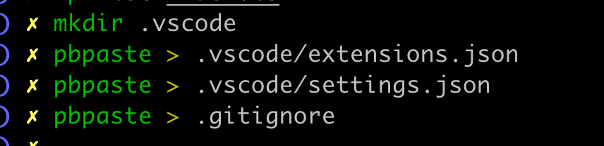

# TypeScript (TS) Intro and Overview

## What is TypeScript?

TypeScript is a superset of JavaScript. This means that it wraps around JavaScript and adds additional features to the language. It is a language that is compiled into JavaScript. This means that TypeScript code is not run directly in the browser/Node. Instead, it is compiled into JavaScript code that is run in the browser/Node.

Above all, it adds type annotations to the language. It is a statically typed language, meaning that the types are checked at compile time, not at runtime. This is in contrast to JavaScript, which is dynamically typed, meaning that the types are checked at runtime.

The primary motivation behind using TS is overall developer 👨🏾‍💻 experience. When properly integrated into VS Code, we get _real-time_ feedback on some common mistakes that we might make in our code. This goes above and beyond linting, which is a static analysis tool that checks for syntax errors and style issues. TS can catch errors that would otherwise be caught at runtime, which is a huge win for developers.

By runtime, we mean that with plain JS, we would have to run the code and wait it for it to crash (think 💭 `undefined.`) - _runtime errors._ JS lets us do pretty much whatever we want. It's very loose, which makes it easy to get started with but opens up the possibility for a lot of errors. TS helps us catch these errors before we run the code. With anything, there are pros and cons. Naturally, TS takes effort to learn and use, but it can save us time in the long run, especially on larger projects and/or when working with a team where not everyone can be intimately familiar with every part of the codebase.

Be warned ⚠️, TS can also be frustrating at times and difficult. But, usually anything worth doing is! It's a tool that can help us write better code, but it's not a silver bullet. It's not a replacement for writing good tests, for example. It's also not a replacement for writing good documentation. It's just another tool that we must understand to use properly. Of course, whenever in doubt, consult the docs 📝 and/or use ChatGPT, etc.

---

<div style="position: relative; padding-bottom: 56.25%; height: 0;"><iframe src="https://www.loom.com/embed/0b64f8bfec7c410eacde56fd09c72a83?sid=6ea9b0ab-0bbf-4f87-a12e-99ae40fb50b9" frameborder="0" webkitallowfullscreen mozallowfullscreen allowfullscreen style="position: absolute; top: 0; left: 0; width: 100%; height: 100%;"></iframe></div>

In the video, I also show the use of `gh`. Unlike most of the other content, you _don't_ need to actually follow along. I will be creating the template repo that we will be using for actually working with TS! Of course, you can follow along if you'd like, but it's about actually applying TS and a lot of this other stuff is just boilerplate.

Also, even though I created the repo on `KodeDen`, I forgot to add the `--clone` or `-c` _flag_ to simultaneously clone it! See [docs](https://cli.github.com/manual/gh_repo_create).

## TS - First Blood 🩸

[Video](https://screenpal.com/player/c0XXY6VG3br?ff=1&title=0&width=100%&height=100%)

## TS Template Repo Config 💩

For this section, you may wish to reference below if you prefer using the terminal to do stuff:



Time for some 'busy work.' First, create a `.gitignore` _in the root of our repo._ Copy paste the standard Node project `.gitignore` from [here](https://raw.githubusercontent.com/github/gitignore/main/Node.gitignore).

---

In `vscode/extensions.json`:

```json
{
  "recommendations": [
    "dbaeumer.vscode-eslint",
    "esbenp.prettier-vscode",
    "mattpocock.ts-error-translator",
    "ms-vscode.vscode-typescript-next",
    "streetsidesoftware.code-spell-checker",
    "usernamehw.errorlens",
    "vivaxy.vscode-conventional-commits"
  ]
}
```

---

In `.vscode/settings.json`:

```json
{
  "editor.codeActionsOnSave": {
    "addMissingImports": true,
    "source.fixAll": true,
    "source.organizeImports": true
  },
  "editor.bracketPairColorization.enabled": true,
  "editor.defaultFormatter": "esbenp.prettier-vscode",
  "editor.formatOnSave": true,
  "editor.wordWrap": "wordWrapColumn",
  "eslint.rules.customizations": [
    {
      "rule": "*",
      "severity": "warn"
    }
  ],
  "files.autoSave": "onFocusChange",
  "typescript.validate.enable": true,
  "typescript.updateImportsOnFileMove.enabled": "always",
  "typescript.tsdk": "node_modules/typescript/lib"
}
```

Once you have completed the above steps, you may optional do: `rm index*` to remove 🔥 the demo code from the previous video.

Then, make your first commit:

1. `git add .`
1. `git commit -m "chore: :tada: initial commit"`

## `tsconfig.json`

This configuration 🔧 determines how our TS gets compiled. There are way too many rules and settings to keep up with as TS has just grown and grown.

First, [watch this](https://youtu.be/eJXVEju3XLM?si=56huHiywtv0bHrt5).

Secondly, install a couple of 📦s that we will extend from:

```shell
npm install --save-dev @tsconfig/recommended
npm install --save-dev @tsconfig/node-lts
```

Then create a `tsconfig.json` in _the root of your project_ and paste in the following:

```json
{
  "extends": [
    "@tsconfig/recommended/tsconfig.json",
    "@tsconfig/node-lts/tsconfig.json"
  ],
  "compilerOptions": {
    /* Base Options: */
    "esModuleInterop": true,
    "skipLibCheck": true,
    "target": "es2022",
    "allowJs": false,
    "resolveJsonModule": true,
    "moduleDetection": "force",
    "isolatedModules": true,

    /* Strictness */
    "strict": true,
    "allowUnreachableCode": false,
    "allowUnusedLabels": false,
    "exactOptionalPropertyTypes": true,
    "noFallthroughCasesInSwitch": true,
    "noImplicitOverride": true,
    "noImplicitReturns": true,
    "noPropertyAccessFromIndexSignature": true,
    "noUncheckedIndexedAccess": true,
    "noUnusedLocals": true,
    "noUnusedParameters": true,

    /* If transpiling with TypeScript: */
    "moduleResolution": "NodeNext",
    "module": "NodeNext",
    "outDir": "dist",
    "sourceMap": true,

    /* If your code doesn't run in the DOM: */
    "lib": ["es2022"]
  }
}
```

### Additional Info ℹ️ on `tsconfig.json`

In a `tsconfig.json` file, when there are conflicting rules between the local configuration and the configurations imported via the `"extends"` field, the local configuration rules "win". This means that the settings defined directly in your `tsconfig.json` file will override any corresponding settings from the configurations it extends.

Here's how it works:

1. **Inheritance**: The `"extends"` field in `tsconfig.json` is used to inherit configurations from other `tsconfig` files. This allows you to base your configuration on a preset and then customize it further.

2. **Overriding**: If your `tsconfig.json` file specifies a configuration option that is also specified in one of the extended files, your local configuration will override the inherited one.

3. **Order of Resolution**: TypeScript resolves the configuration by first loading the settings from the extended file(s). It then applies the settings from your local `tsconfig.json`, overriding any duplicated settings.

This feature is particularly useful for maintaining consistency across projects while allowing for necessary customizations in each specific project.

For example, if you extend a configuration that sets `strict` to `false` but in your local `tsconfig.json` you set `strict` to `true`, your local setting of `true` will be the effective setting for your project.
